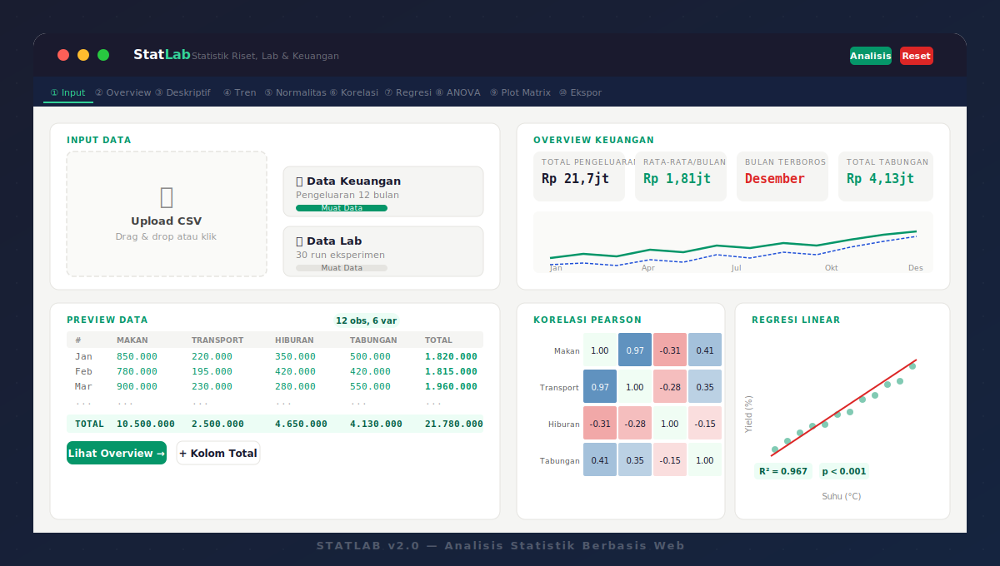

# StatLab v2.0

> Aplikasi analisis statistik berbasis web — untuk riset akademik, data lab eksperimen, dan analisis keuangan pribadi. Tidak perlu install, tidak perlu internet, buka langsung di browser.



https://xian0000000.github.io/statistic/ <-- web preview
---

## Fitur

| Tab | Fitur |
|-----|-------|
| ① Input | Upload CSV, drag & drop, data contoh keuangan & lab |
| ② Overview | Dashboard ringkasan, tabel total otomatis, komposisi pie chart |
| ③ Deskriptif | Mean, median, modus, SD, varians, skewness, kurtosis, CV%, kuartil |
| ④ Tren | Moving average, slope tren linear, tabel perubahan periode ke periode |
| ⑤ Normalitas | Uji Shapiro-Wilk + QQ Plot per variabel |
| ⑥ Korelasi | Pearson & Spearman, heatmap warna, tabel r/p/signifikansi |
| ⑦ Regresi | Simple & multiple regression, plot regresi & residual |
| ⑧ ANOVA | One-way ANOVA, tabel ANOVA lengkap, plot distribusi per grup |
| ⑨ Plot Matrix | Scatter plot matrix antar semua variabel |
| ⑩ Ekspor | CSV, JSON, dan laporan HTML siap cetak |

---

## Struktur Folder

```
statlab/
├── index.html              # Entry point utama
├── README.md               # Dokumentasi ini
├── css/
│   └── style.css           # Semua styling (variabel, komponen, layout)
├── js/
│   ├── math.js             # Engine statistik (kalkulasi murni, zero dependency)
│   ├── data.js             # Manajemen data (parse CSV, state, auto-detect mode)
│   ├── ui.js               # Utilitas UI (DOM helpers, toast, tab, download)
│   ├── charts.js           # Wrapper Chart.js (histogram, scatter, KDE, heatmap)
│   ├── analysis.js         # Panel analisis (render setiap tab)
│   └── app.js              # Controller utama (routing, events, ekspor)
└── data/
    ├── sample_keuangan.csv # Contoh data pengeluaran bulanan
    └── sample_lab.csv      # Contoh data eksperimen kimia
```

---

## Cara Pakai

### 1. Buka Langsung di Browser
```bash
# Clone atau download repo
git clone https://github.com/username/statlab.git
cd statlab

# Buka di browser (tidak perlu server)
open index.html
# atau double-click index.html di file explorer
```

### 2. Dengan Local Server (opsional, untuk development)
```bash
# Python
python3 -m http.server 8000

# Node.js
npx serve .

# Buka http://localhost:8000
```

---

## Format CSV

Baris pertama harus berisi **nama kolom** (header). Semua kolom numerik akan otomatis terdeteksi.

```csv
Periode,Makan,Transport,Hiburan,Tabungan
Jan,850000,220000,350000,500000
Feb,780000,195000,420000,420000
Mar,900000,230000,280000,550000
```

**Tips:**
- Kolom teks (seperti nama bulan) di kolom pertama akan digunakan sebagai label baris
- Nilai Rupiah boleh tanpa pemisah ribuan (850000 ✓, Rp 850.000 juga terbaca)
- Baris kosong otomatis diabaikan

---

## Statistik yang Dihitung

### Deskriptif
- N, Sum, Mean, Median, Modus
- Varians (sampel), Simpangan Baku, Standard Error
- Koefisien Variasi (CV%)
- Min, Maks, Rentang
- Kuartil Q1/Q2/Q3, IQR
- Skewness, Kurtosis (excess)
- Persentil P5, P10, P25, P75, P90, P95
- Outlier detection (metode Tukey, 1.5×IQR)

### Inferensial
- **Shapiro-Wilk** — uji normalitas
- **Pearson / Spearman** — korelasi bivariat dengan p-value
- **Regresi Linear** — simple & multiple, R², R² adjusted, F-test, t-test per koefisien
- **ANOVA Satu Arah** — F-statistik, SS/MS/df, p-value

### Visualisasi
- Histogram (kelas otomatis)
- QQ Plot (uji normalitas visual)
- KDE vs Normal curve
- Scatter plot & regression line
- Residual plot
- Correlation heatmap
- Scatter plot matrix
- Line chart dengan moving average & trend line
- Doughnut chart komposisi
- Stacked area chart

---

## Konfigurasi Mode Otomatis

StatLab secara otomatis mendeteksi jenis data:

| Mode | Trigger | Tampilan |
|------|---------|----------|
| **Keuangan** | Nama kolom mengandung: makan, transport, hiburan, tagihan, tabungan, belanja, gaji, dll | Format Rupiah, dashboard bulanan, kolom total |
| **Umum/Lab** | Nama kolom lainnya | Format angka standar, histogram per variabel |

---

## Dependensi

| Library | Versi | Fungsi |
|---------|-------|--------|
| [Chart.js](https://www.chartjs.org/) | 4.4.1 | Rendering semua chart |

Semua kalkulasi statistik ditulis dari nol dalam `js/math.js` tanpa library tambahan.

---

## Browser Support

| Browser | Status |
|---------|--------|
| Chrome / Chromium | ✅ Full support |
| Firefox | ✅ Full support |
| Safari | ✅ Full support |
| Edge | ✅ Full support |

---

## Cara Berkontribusi

1. Fork repo ini
2. Buat branch fitur: `git checkout -b fitur/nama-fitur`
3. Commit perubahan: `git commit -m 'Tambah fitur X'`
4. Push ke branch: `git push origin fitur/nama-fitur`
5. Buat Pull Request

### Ide Fitur Tambahan
- [ ] Uji t (independent & paired)
- [ ] Chi-square test
- [ ] Mann-Whitney U test
- [ ] Post-hoc test ANOVA (Tukey HSD)
- [ ] Time series decomposition
- [ ] Multiple comparison correction (Bonferroni)

---

## Catatan Teknis

- Semua kalkulasi berjalan di **client-side** (browser), tidak ada data yang dikirim ke server
- Implementasi Shapiro-Wilk menggunakan aproksimasi Royston (1992), valid untuk n = 3–5000
- Regresi multiple menggunakan **Ordinary Least Squares** dengan inversi matriks Gauss-Jordan
- Heatmap korelasi dirender dengan **Canvas 2D API** (bukan Chart.js) untuk performa lebih baik

---

## Lisensi

MIT License — bebas digunakan, dimodifikasi, dan didistribusikan.

---

*StatLab dibuat untuk memudahkan analisis statistik tanpa harus install R, SPSS, atau Python. Cocok untuk pelajar, mahasiswa, dan peneliti yang butuh analisis cepat.*
